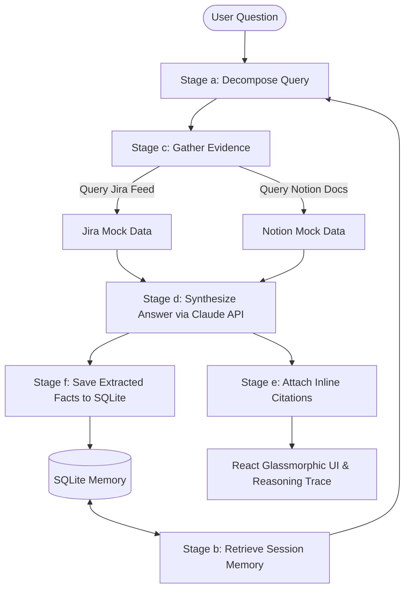

# Agentic RAG Over Live Data and Memory (MVP Demo)

A working MVP demo of an **Agentic RAG System** designed for Project Management Q&A over live operational sources (**Jira** and **Notion**) with multi-turn memory persistence.

---

## 🌟 Key Features

1. **Multi-Step Query Decomposition**:
   - Decomposes natural-language user questions into 2-4 target sub-questions.
   - Tags sub-questions with specific data targets (`jira`, `notion`, or `both`).

2. **Multi-Source Evidence Retrieval (Jira & Notion)**:
   - Queries mocked Jira tickets (status, assignees, descriptions) and Notion pages (architecture docs, meeting notes, PRDs).
   - Serves mock data through loader modules (`backend/data_loader.py`) simulating live REST APIs.

3. **Inline Citations & Interactive Tooltips**:
   - Synthesizes answers where every factual statement contains clickable citation tags like `[Jira #JIRA-101]` or `[Notion #NOTION-3]`.
   - Clicking citation pills opens a detailed **Source Preview Modal** with full evidence snippets, assignee metadata, and URL links.

4. **Cross-Session Memory Persistence (SQLite)**:
   - Stores session history and automatically extracted key facts in local SQLite tables (`sessions`, `qa_history`, `facts`).
   - Remembers past facts across turns so the agent doesn't re-derive the same context twice.
   - Includes a live **SQLite Memory Vault Drawer** in the UI to inspect stored facts.

5. **Transparent Reasoning Trace Panel**:
   - Renders a collapsible 4-step "Reasoning Trace" visualization per response:
     - **Step 1:** Retrieve Session Memory
     - **Step 2:** Decompose Query
     - **Step 3:** Gather Evidence
     - **Step 4:** Synthesize & Attach Citations
   - Displays execution latency per stage and raw JSON step output.

---

## 🏗️ Architecture & Pipeline Overview



### Note on Production Vector DB vs MVP SQLite
> **Architecture Note:** For this MVP, memory retrieval uses SQLite relational tables with keyword filtering. In a production environment, this layer would be replaced by a hybrid vector database (e.g., ChromaDB, Pinecone, or pgvector) for semantic similarity search as specified in the full PRD.

---

## 🚀 Quick Start Guide

### Prerequisites
- **Python 3.10+**
- **Node.js 18+** & **npm**
- *(Optional)* Anthropic Claude API Key (`ANTHROPIC_API_KEY`)

---

### 1. Backend Setup (FastAPI & Uvicorn)

1. Open terminal in the project root directory:
   ```bash
   cd agentic-rag-live-data-memory
   ```

2. (Optional) Create and activate a Python virtual environment:
   ```bash
   python3 -m venv .venv
   source .venv/bin/activate
   ```

3. Install backend dependencies:
   ```bash
   pip install -r requirements.txt
   ```

4. Configure your Anthropic API Key:
   - Copy `.env.example` to `.env`:
     ```bash
     cp .env.example .env
     ```
   - Add your key to `.env`:
     ```env
     ANTHROPIC_API_KEY=sk-ant-api03-...
     ```
   > **Note:** If `ANTHROPIC_API_KEY` is omitted, the backend automatically engages a **heuristic synthesis fallback mode**, allowing full end-to-end demo testing without API credentials!

5. Run the FastAPI backend server:
   ```bash
   uvicorn backend.main:app --reload --port 8000
   ```
   The API will be live at `http://127.0.0.1:8000`. Test endpoint: `http://127.0.0.1:8000/health`.

---

### 2. Frontend Setup (React + Vite)

1. In a second terminal window, navigate to `frontend`:
   ```bash
   cd agentic-rag-live-data-memory/frontend
   ```

2. Install Node dependencies:
   ```bash
   npm install
   ```

3. Start the Vite development server:
   ```bash
   npm run dev
   ```

4. Open `http://localhost:5173` in your browser.

---

## 🧪 Recommended Test Queries

The seed dataset contains answerable facts for Project X. Try these questions in order:

1. **Quarterly Changes & Blockers:**
   > *"What changed in Project X this quarter and what's blocked?"*
   - *Expected:* Agent pulls architecture updates from Notion (`NOTION-1`, `NOTION-2`) and blocked tickets from Jira (`JIRA-101`, `JIRA-102`, `JIRA-103`).

2. **Blocked Tasks & Ownership:**
   > *"What tasks are blocked and who owns them?"*
   - *Expected:* Cites `JIRA-101` (Sarah Chen), `JIRA-102` (Alex Rivera), and `JIRA-103` (David Kim).

3. **Launch Risk Summary:**
   > *"Summarize the launch risk discussion and compliance status."*
   - *Expected:* Pulls meeting notes from `NOTION-3` (SOC2 audit logs risk, Stripe rate limits) and `JIRA-106` (Marcus Vance).

4. **Testing Session Memory (Follow-up):**
   > *"Based on our conversation, what security and auth items need immediate attention?"*
   - *Expected:* The agent uses facts retrieved from SQLite memory (saved during turns 1-3) to highlight OAuth migration (`JIRA-101`) and SOC2 logging (`JIRA-106`).

---

## 🛡️ Risk Mitigation: Mock Data vs Real Integrations

Per the PRD risk mitigation plan, this MVP uses **mocked Notion and Jira JSON files** (`/data/notion_mock.json` & `/data/jira_mock.json`) served via `backend/data_loader.py`.

### Moving to Production Integrations:
To transition from mock files to live OAuth/MCP integrations:
1. Replace `search_notion()` in `backend/data_loader.py` with the `@notionhq/client` SDK or Notion API (`https://api.notion.com/v1/search`) using Integration Tokens.
2. Replace `search_jira()` with the Jira REST API (`https://your-domain.atlassian.net/rest/api/3/search?jql=...`) using Basic Auth / API Tokens.
3. Wire vector embeddings (OpenAI `text-embedding-3-small` or Cohere Embed) for document chunking in ChromaDB.

---

## 📁 Project Structure

```
agentic-rag-live-data-memory/
├── data/
│   ├── notion_mock.json       # 10 Notion pages (architecture, risks, roadmap)
│   └── jira_mock.json         # 12 Jira tickets (blocked, done, in-progress)
├── backend/
│   ├── main.py                # FastAPI endpoints (/ask, /sessions, /health)
│   ├── pipeline.py            # 6-stage Agentic RAG orchestration engine
│   ├── data_loader.py         # Search & filter functions for Jira/Notion mock data
│   ├── db.py                  # SQLite database manager (sessions, qa_history, facts)
│   └── llm_service.py         # Claude API integration & structured JSON parser
├── frontend/
│   ├── index.html             # Vite entry HTML
│   ├── package.json           # React 18, Vite, Lucide-react, TailwindCSS
│   └── src/
│       ├── App.jsx            # Main app container & state manager
│       ├── api.js             # HTTP client for FastAPI backend
│       └── components/
│           ├── ChatInterface.jsx        # Chat feed & bottom prompt form
│           ├── CitationBadge.jsx        # Interactive pill badges & citation parser
│           ├── ReasoningTracePanel.jsx  # Collapsible 4-step pipeline trace panel
│           ├── SourceModal.jsx          # Evidence item preview modal
│           ├── MemoryDrawer.jsx         # Live SQLite Memory Vault
│           ├── Header.jsx               # Navigation bar & system status
│           └── SampleQueries.jsx        # Seed question chips
├── requirements.txt           # Python backend dependencies
├── .env.example               # Environment variables template
└── README.md                  # System documentation
```
